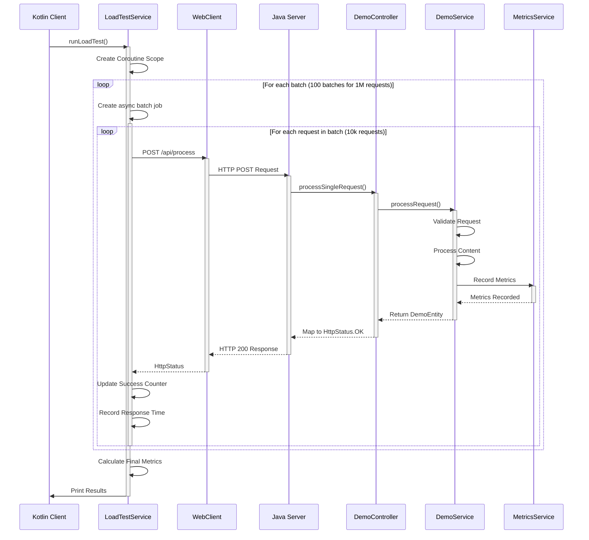

# High-Performance WebFlux Server with Kotlin Load Testing Client

A high-performance reactive web server built with Spring WebFlux, capable of handling 50,000+ concurrent requests per second. This project includes both a Java-based WebFlux server and a Kotlin-based load testing client that can generate and monitor 1 million HTTP requests.

## 🚀 Performance Highlights

Recent benchmark results show impressive performance:
- Processing 1 million requests in 19 seconds
- Achieving 51,187 requests per second
- 100% success rate with zero failures
- Average response time of 1.91ms
- 99.93% of requests completed under 100ms

## 🏗️ Architecture

The project consists of two main components:

1. **Java WebFlux Server**
   - Built with Spring WebFlux and Netty
   - Optimized for high concurrency using event-loop architecture
   - Efficient metrics collection and monitoring
   - Non-blocking reactive processing pipeline

2. **Kotlin Load Testing Client**
   - Coroutine-based concurrent request generation
   - Real-time metrics collection and progress monitoring
   - Detailed performance analytics and reporting
   - Efficient memory management for large-scale testing

### System Flow
The sequence diagram below illustrates the interaction between components:




## 🛠️ Technical Stack
Server (Java)

Spring Boot 3.x
Spring WebFlux
Netty
Spring Actuator
Micrometer
Reactor Core

## Client (Kotlin)

Kotlin Coroutines
Spring WebFlux WebClient
Kotlin Reactor Extensions
SLF4J Logging

## 📊 Performance Tuning
Server Optimizations

Event loop thread pooling
Memory management optimization
Connection pool tuning
Garbage collection optimization
Non-blocking I/O operations

## Client Optimizations

Coroutine-based concurrent processing
Efficient metrics collection
Memory-efficient response time tracking
Real-time progress monitoring

## 🚦 Getting Started
Prerequisites

## JDK 17 or higher
Gradle 8.x
IntelliJ IDEA (recommended)

## Running the Server
```
bashCopycd server
./gradlew bootRun
```
## Running the Load Test Client

```
cd client
./gradlew bootRun
```

###🔧 Configuration
## Server Configuration
```
# application.properties
reactor.netty.ioWorkerCount=32
spring.reactor.netty.pool.maxConnections=500000
spring.reactor.netty.pool.acquireTimeout=50
reactor.netty.pool.maxPendingAcquires=500000
```
## JVM Optimization Flags
```
-XX:+UseG1GC
-XX:MaxGCPauseMillis=20
-XX:ParallelGCThreads=24
-XX:ConcGCThreads=6
-XX:InitialHeapSize=4g
-XX:MaxHeapSize=4g
-XX:+UseNUMA
-XX:+AggressiveOpts
```

## 📈 Monitoring and Metrics
# The server exposes various metrics endpoints:
- /actuator/metrics/http.requests.successful
- /actuator/metrics/http.requests.failed
- /actuator/metrics/http.request.latency


